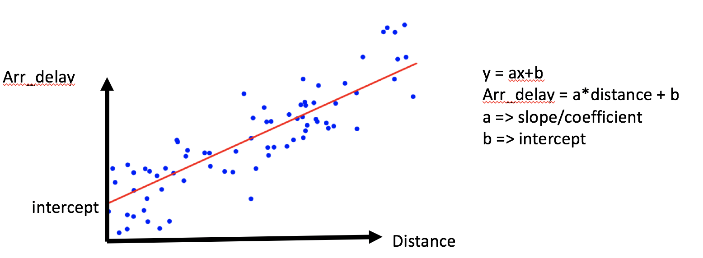

# Build your first Machine Learning model

Source: [ hockeygeekgirl / MyFirstSciKitLearnModel ](https://github.com/hockeygeekgirl/MyFirstSciKitLearnModel)
Train your first machine learning model using Jupyter Notebooks and python.

## Tools used

**[Jupyter Notebooks](https://jupyter.org/)** are a great tool for learning and training data models. You can write Python code using other development environments such as Visual Studio Code, but the ability to break up the code and execute it in chunks, and to see output including graphs as you are training the model makes it easier to explore and prepare your data and models. You can install and run notebooks locally. If you need more processing power you can run Jupyter notebooks on cloud platforms:
- **[Jupyter on Azure](https://notebooks.azure.com/)** 
- **[Jupyter on AWS](https://s3-ap-southeast-2.amazonaws.com/scico-labs/docs/lab-jupyter-aws.pdf)**
- **[Jupyter on Google](https://cloud.google.com/ai-platform-notebooks/)**
- **[Jupyter on IBM](https://dataplatform.cloud.ibm.com/docs/content/wsj/analyze-data/creating-notebooks.html)**

## Python libraries used
- **numpy**  contains a number of useful mathematical operations including some that are helpful when evaluating accuracy of trained models
- **pandas** contains the dataframe object and a number of useful methods for manipulating and querying data contained in a dataframe
- **scikitlearn** contains a number of machine learning algorithms and methods for splitting data, calculating accuracy of models, and training models
- **matplotlib** used to plot graphs and visualize data

## Data used
- **all_flights.csv** this data came from the US Department of Transportation and provides information about scheduled flights in the United States.
 

## Notebooks provided
In this repository you will find a series of Jupyter Notebooks to walk you through training a machine learning model.

I recommend exploring the notebooks in the following order so you can learn one concept at a time.

- **BasicMLExample.ipynb**  - This notebook walks you through predicting a numeric value (how many minutes late a flight will arrive) based on another numeric value (flight distance). Then you check the accuracy of the model and explore data correlation. Then you retrain the model using departure delay to predict arrival delay to see if you get better accuracy.
- **MultipleFeatureMLModel.ipynb** - In the first notebook you were only able to make a prediction based on a single column of data. In this notebook we try training a model with multiple columns of data (Distance & Departure delay) to see if we get better accuracy
- **NonNumericFeaturelinear.ipynb** - In the first two notebooks we deliberately chose numeric columns to make our predictions, but what if you want to make predictions based on a non-numeric value? In this notebook we try to predict flight delay based on which airline is operating the flight using a technique called one-hot encoding.
- **NonNumericMultipleFeatureLinear.ipynb** - In this notebook we combine all the techniques from the previous notebooks to use a combination of numeric and non-numeric columns to predict arrival flight delay.
- **LinearRegressionOrdinalFeature.ipynb** - In this notebook, we transform distance from a continuous value to a numeric ranking indicating short, medium, and long trips to try and improve our model.

## Machine Learning concepts

The notebooks walk you through the basic steps of machine learning
1. Define the problem
2. Find the data
3. Explore the data
4. Clean and prepare the data
5. Put aside testing data
6. Train the model
7. Test the model
8. Check accuracy
9. Repeats steps as necessary

## Suggested next steps

Simple regression:

Once you understand the concepts here, you might want to try:

- training a classification model instead of a linear model. e.g. you could try to predict if a flight is late or on-time (requires creating a new column with a flag to indicate late vs on-time based on the value in arrival delay)
- try different techniques for handling non-numeric data  
- try training a model using dates (time-series)

